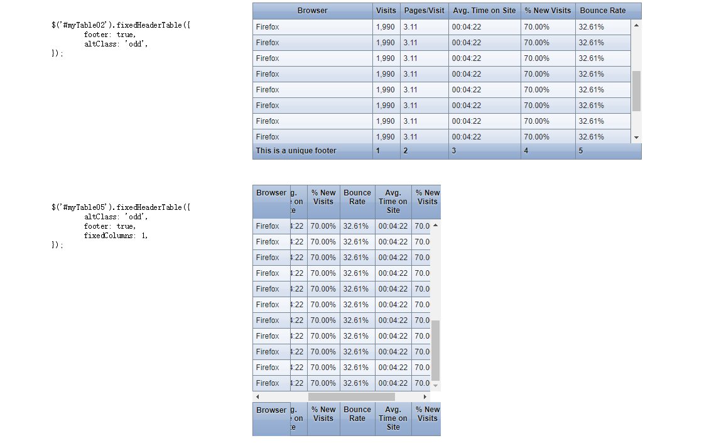

## Version 1.3
 - jquery.fixedheadertable.js
 
 > **如有帮助谢谢star**   :star::star::star::star::star:
 
## 效果图

 
## Methods:

* show - `$('selector').fixedHeaderTable('show');`
* hide - `$('selector').fixedHeaderTable('hide');`
* destroy - `$('selector').fixedHeaderTable('destroy');`

## Options:

* width - Number - Default: 100%
* height - Number - Default: 100%
* fixedColumns - Number - Default: 0
* footer - Boolean - Default: false
* cloneHeadToFoot - Boolean - Default: false
* autoShow - Boolean - Default: true
* altClass - String - Default: none
* themeClass - String - Default: none

### Notes:

If you aren't using the minified version, be sure to include
`lib/jquery.mousewheel.js` in your page if you require mousewheel
scrolling via fixed columns.

https://github.com/markmalek/Fixed-Header-Table
